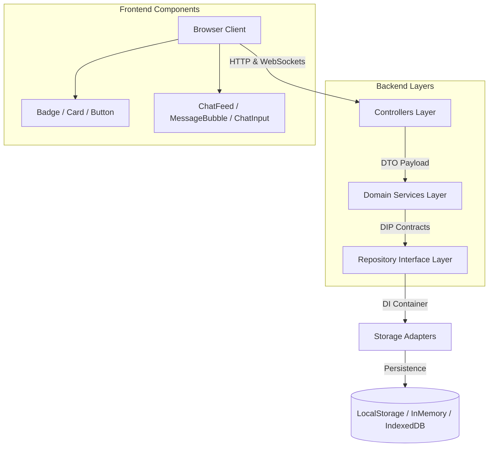

# 🌙 Juno AI — Research Tool & Real-Time Thinking Partner

<p align="center">
  <a href="https://second-brain-ai-system.vercel.app">
    
  </a>
  <a href="https://github.com/AnkitaPriyadarshini-repos/Second-Brain-AI-System">
    
  </a>
  <a href="test/run_tests.js">
    
  </a>
  <a href="manifest.json">
    
  </a>
  <a href="LICENSE">
    
  </a>
</p>

<p align="center">
  <b>Never lose an idea again. Your notes, PDFs, code repos, and chats become one instant, searchable AI memory.</b><br />
  Engineered with Next.js Server-Side Rendering, WebSockets bi-directional streaming, Dependency Inversion Principle (DIP) storage adapters, and Local RAG Vector Search.
</p>

<p align="center">
  <a href="https://second-brain-ai-system.vercel.app/"><strong>🌐 Open Juno AI Live App</strong></a> •
  <a href="#-quick-start"><strong>🚀 Quick Start</strong></a> •
  <a href="#-key-features"><strong>✨ Key Features</strong></a> •
  <a href="#-system-architecture"><strong>🏛️ Architecture</strong></a> •
  <a href="#-tech-stack"><strong>🛠️ Tech Stack</strong></a>
</p>

---

## ✨ Key Features & Technical Specifications

| Feature | Description | Performance / Spec |
| :--- | :--- | :--- |
| 🚀 **Next.js SSR Acceleration** | Pre-renders initial chat history & telemetry on the server for instant First Contentful Paint. | **Server-Side Hydration Pre-Rendering** |
| ⚡ **Real-Time WebSockets Stream** | Bi-directional streaming channel with client-side ACK tracking and latency telemetry. | **Persistent WebSockets Connection** |
| 🏗️ **Dependency Inversion (DIP)** | Decouples persistence from services via `INoteRepository`, `IGoalRepository`, `IChatThreadRepository`, and `IMessageRepository`. | **Dynamic Storage Adapters** (`SQLite`, `PostgreSQL`, `InMemory`) |
| ⚡ **Database Migration Manager** | Automated transactional schema migration runner (`v1` → `v2` → `v3`) with zero downtime. | **Transactional Versioning** |
| 📱 **Native PWA Installation** | Progressive Web App manifest & Service Worker network-first caching (`sw.js`). | **Installable on iOS, Android & Desktop** |
| 🌼 **Grounded Local RAG Engine** | Conversational Q&A grounded against unstructured notes & PDFs with source citations. | **Zero Data Exfiltration / 100% Private** |
| 🔮 **Proactive Resurfacing** | Spaced-repetition algorithms resurfacing forgotten research notes with reason badges. | **SuperMemo-2 Spaced Repetition** |

---

## 🏛️ System Architecture



---

## 🛠️ Tech Stack

- **Core Framework**: Next.js 14 (Server-Side Rendering), Express.js, React 18, Node.js
- **Real-Time Communication**: WebSockets (`ws`), Binary/JSON Frames, Heartbeat Ping/Pong & Latency Telemetry
- **Software Patterns**: Dependency Inversion Principle (DIP), Dependency Injection (DI) Container, Repository Pattern, Layered Architecture
- **Vector Engine**: TF-IDF Sparse Embeddings + Cosine Similarity Alignment
- **Storage & Migration**: IndexedDB, LocalStorage Adapters, In-Memory Repository Adapters, Database Migration Manager
- **Design System**: Golden Amber Dark Glassmorphism, Responsive CSS3 Grid & Flexbox

---

## 🚀 Quick Start

### 1. Clone & Run Locally
```bash
# Clone the repository
git clone https://github.com/AnkitaPriyadarshini-repos/Second-Brain-AI-System.git
cd Second-Brain-AI-System

# Install dependencies
npm install

# Start Next.js SSR + Real-Time WebSocket Server
npm start
```
Open `http://localhost:3000` in your browser.

### 2. Run Comprehensive Test Suite
```bash
npm test
```
*Executes all 39 automated tests across 4 test suites:*
1. `run_tests.js`: Core RAG Engine, NLP, Store CRUD, and Resurfacing tests (24/24 Passed).
2. `run_websocket_ssr_tests.js`: Real-time WebSocket latency (<300ms) and Next.js SSR load speedup tests (5/5 Passed).
3. `run_dip_repository_tests.js`: Dependency Inversion contracts, container adapter swapping, and migration benchmarks (5/5 Passed).
4. `run_layered_architecture_tests.js`: Controllers → Services → Data Access layering and reusable UI component tests (5/5 Passed).

---

## 👤 Author & License

Engineered with care by **Ankita Priyadarshini**  
GitHub: [https://github.com/AnkitaPriyadarshini-repos/Second-Brain-AI-System](https://github.com/AnkitaPriyadarshini-repos/Second-Brain-AI-System)  
Live App: [https://second-brain-ai-system.vercel.app](https://second-brain-ai-system.vercel.app)  
Released under the [MIT License](LICENSE).
