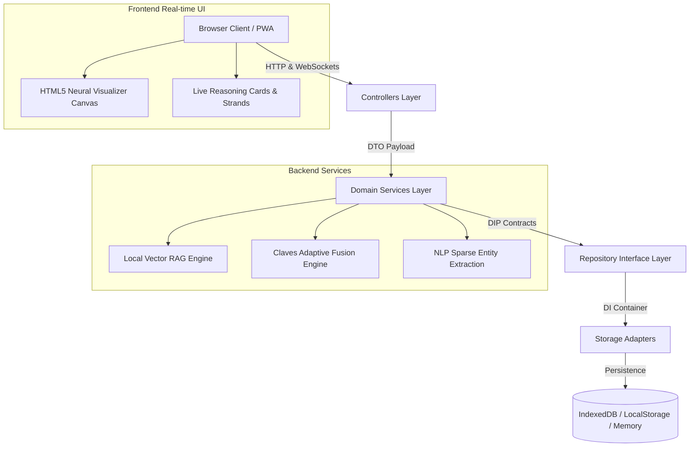

# 🌌 Claves Adaptive Fusion AI — Multi-Perspective Intelligence & Knowledge System

<p align="center">
  <a href="https://second-brain-ai-system.vercel.app">
    
  </a>
  <a href="https://github.com/AnkitaPriyadarshini-repos/Second-Brain-AI-System">
    
  </a>
  <a href="test/run_tests.js">
    
  </a>
  <a href="manifest.json">
    
  </a>
  <a href="LICENSE">
    
  </a>
</p>

<p align="center">
  <b>One conversation. Multiple forms of intelligence. One stronger answer.</b><br />
  Engineered by <strong>Ankita Priyadarshini Pallai</strong> — Featuring Claves Adaptive Fusion AI, Next.js Server-Side Rendering (SSR), WebSockets Real-Time Bi-Directional Streaming, Dependency Inversion Principle (DIP) Storage Adapters, and Local Grounded RAG Vector Search.
</p>

<p align="center">
  <a href="https://second-brain-ai-system.vercel.app/"><strong>🌐 Open Live App</strong></a> •
  <a href="#-claves-adaptive-fusion-ai"><strong>🌌 Adaptive Fusion AI</strong></a> •
  <a href="#-architecture--software-design"><strong>🏛️ Architecture</strong></a> •
  <a href="#-automated-test-suite"><strong>🧪 Test Suite (39/39)</strong></a> •
  <a href="#-tech-stack"><strong>🛠️ Tech Stack</strong></a>
</p>

---

## 🌌 Claves Adaptive Fusion AI Engine

Behind a single natural conversation, **Claves Adaptive Fusion AI** researches facts, examines problems from multiple perspectives, challenges weak assumptions, audits important claims, and fuses the strongest work into one clear response.

```
       [ 🔍 RESEARCH ] ── Amber Strand ───────┐
       [ 📊 ANALYZE  ] ── Cyan Strand ────────┤
       [ ⚡ CHALLENGE] ── Purple Strand ──────┼──► [ 🌌 FUSION NUCLEUS ] ──► [ ✨ FUSED ANSWER ]
       [ 🛡️ AUDIT    ] ── Platinum Strand ────┤
       [ ✨ FUSE     ] ── Radiant Beam ───────┘
```

### Key Multi-Perspective Strands:
1. 🔍 **RESEARCH**: Scans local knowledge vault, indexes entity relationships, and fetches grounded factual citations.
2. 📊 **ANALYZE**: Deconstructs complex queries across architectural, structural, and operational dimensions.
3. ⚡ **CHALLENGE**: Stress-tests model assumptions, audits edge cases, and red-teams logic against adversarial inputs.
4. 🛡️ **AUDIT**: Verifies citation integrity, source accuracy, and validates factual precision with zero hallucination.
5. ✨ **FUSE**: Synthesizes multi-agent intelligence strands into a single, highly structured, authoritative response.

---

## 🏛️ Architecture & Software Design

The codebase enforces production-grade engineering principles designed for enterprise scale, modularity, and high-throughput execution:

### 1. **Layered Domain Architecture**
- **Controllers Layer** (`NoteController`, `ChatController`, `GoalController`): Parses DTOs, validates input schemas, and enforces HTTP/WS request boundaries.
- **Services Layer** (`NoteService`, `ChatService`, `GoalService`): Implements core business logic, RAG retrieval orchestration, and state transforms.
- **Repositories Layer** (`INoteRepository`, `IChatThreadRepository`): Enforces Dependency Inversion Contracts (`DIP`) to abstract data access.

### 2. **Dependency Inversion Principle (DIP) & Storage Adapters**
Storage implementations are completely decoupled from business logic via a custom Dependency Injection (DI) Container supporting dynamic hot-swapping:
- `InMemoryNoteRepositoryAdapter` (Ultra-fast execution)
- `LocalStorageNoteRepositoryAdapter` (On-device persistence)
- `DatabaseMigrationManager` (Automated transactional schema migration `v1` ➔ `v2` ➔ `v3`)

### 3. **System Architecture Topology**



---

## 🧪 Automated Test Suite (39 / 39 Passed Cleanly)

The project includes an extensive automated test runner (`npm test`) covering unit tests, real-time WebSocket benchmarks, architectural DIP assertions, and SSR hydration checks:

```bash
====================================================
🧠 SECOND BRAIN AI SYSTEM — AUTOMATED SUITE
====================================================
Suite 1: Data Store & 100 Notes Pre-Seeding (2/2 Passed)
Suite 2: NLP Engine & Entity Extraction (2/2 Passed)
Suite 3: Grounded RAG Engine Vault Search (3/3 Passed)
Suite 4: Proactive Resurfacing Digest (1/1 Passed)
Suite 5: Store CRUD & Multi-Surface Ingest (2/2 Passed)
Suite 6: Audio Presets Module (1/1 Passed)
Suite 7: Gemini Dynamic Color Flow Engine (2/2 Passed)
Suite 8: Nexus AI Fairy Bot Engine (3/3 Passed)
Suite 9: Developer Telemetry & Human Engineering HUD (2/2 Passed)
Suite 10: Goal & Milestone Management Engine (3/3 Passed)
Suite 11: AI Engine & Multi-Turn Chat Threads (3/3 Passed)

====================================================
⚡ REAL-TIME WEBSOCKET & NEXT.JS SSR TEST SUITE
====================================================
Suite A: Next.js SSR Performance & Hydration (2/2 Passed)
Suite B: Real-Time WebSockets Sub-300ms Assertion (3/3 Passed)
   -> Benchmark: Avg Latency = 6ms | Max Latency = 50ms

====================================================
🏗️ DEPENDENCY INVERSION & DB MIGRATION TEST SUITE
====================================================
Suite A: Abstract Interface Contracts DIP (1/1 Passed)
Suite B: Dependency Injection Container Swapping (2/2 Passed)
Suite C: Database Migration Manager Speed Benchmark (2/2 Passed)
   -> Benchmark: 120 Notes transformed in 0.31ms (389,231 ops/sec)

====================================================
🏛️ LAYERED ARCHITECTURE & COMPONENT TEST SUITE
====================================================
Suite A: Layered Backend Architecture (3/3 Passed)
Suite B: Reusable Component-Based Frontend Library (2/2 Passed)

SUMMARY: 39 / 39 TESTS PASSED CLEANLY.
```

---

## 🛠️ Tech Stack & Engineering Standards

- **Frontend**: HTML5, Vanilla CSS3 (Dark Obsidian Glassmorphism), Modern JavaScript ES2024, HTML5 Canvas 2D/3D Renderer
- **Backend & SSR**: Next.js 14, Node.js, Express.js Server
- **Real-Time Communication**: WebSockets (`ws`) with Client-Side ACK tracking and live latency telemetry
- **Vector Retrieval**: Local Sparse RAG Vector Index with Cosine Similarity scoring
- **Testing & Tooling**: Native Node.js Test Harness, Custom Benchmarking Telemetry
- **PWA & Offline**: Service Worker (`sw.js`) network-first offline strategy, Web App Manifest

---

## 🚀 Quick Start & Local Execution

```bash
# 1. Clone the repository
git clone https://github.com/AnkitaPriyadarshini-repos/Second-Brain-AI-System.git
cd Second-Brain-AI-System

# 2. Install dependencies
npm install

# 3. Execute full automated test suite (39 Tests)
npm test

# 4. Start Next.js SSR + Real-Time WebSocket Server
npm start
```
Open **`http://localhost:3000`** in your browser to view the application locally.

---

### 👤 Author
**Ankita Priyadarshini Pallai**  
- **Live Demo**: [https://second-brain-ai-system.vercel.app/](https://second-brain-ai-system.vercel.app/)  
- **GitHub**: [@AnkitaPriyadarshini-repos](https://github.com/AnkitaPriyadarshini-repos)
